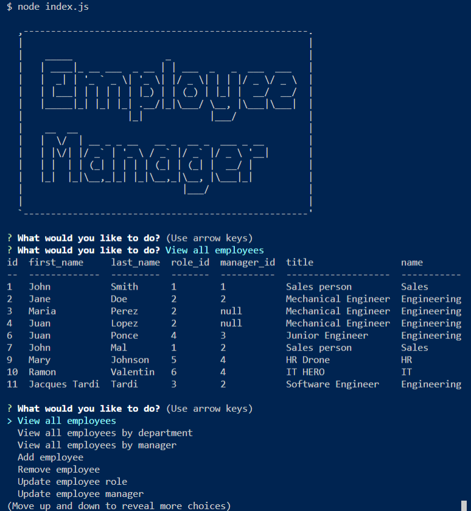

# Employee Tracker  

## Description 
 
Employee Tracker is a NodeJS application that allows the user to update employee, department and role information using CLI. 

## Table of Contents 

* [Usage](#usage-information) 

* [Installation](#installation-instructions) 

* [Where to Contribute](#where-to-contribute) 

* [Repository](#repository) 

* [URL](#url) 

* [Questions](#questions) 

* [Screenshot](#screenshot) 

## Usage Information 
 
    This command line application allows the user to maintaint the view and manage the different employee, departmentand roles. It also allows the employer to organize and plan the HR business aspect of the operation. 

## Installation Instructions 
 
    npm i 

## Where to Contribute 
 
Send any requests to the GitHub below.  

## Repository 
 
This repository is hosted in GitHub and you may access it at [https://github.com/johnsbrook/10-Employee-Tracker](https://github.com/johnsbrook/10-Employee-Tracker). 

## URL 
 
[https://johnsbrook.github.io/10-Employee-Tracker/](https://johnsbrook.github.io/10-Employee-Tracker/)

[Video Demostration - Youtube](https://youtu.be/Cff3_Yf4Lhg)

## Questions 
 
GitHub: [johnsbrook](https://github.com/johnsbrook) 
 
Email: [ivan.zapata-rivera@gmail.com](mailto:ivan.zapata-rivera@gmail.com)

## Screenshot 
 
 
 
